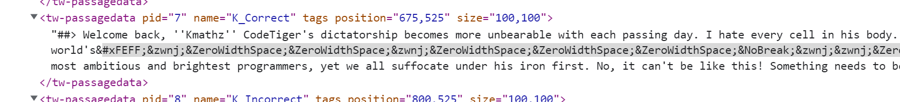

# misc/MURDER MYSTERY

## Challenge

[LIT murder mystery](http://litctf.live:31774/)... who could be the culprit? Please wrap it in `LITCTF{}`
<br>
<br>
Some things are like the apparition of CodeTiger. He may appear to have zero mass or width, effectively invisible, but he's still always there with us &lt;3

## Solution

Oh no, it's interactive fiction... three suspects, a clue under the first and passwords needed for the other two. Multi-part challenge? Aw.

The challenge hint suggests there's some content hidden somewhere here, so let's look in the inspector.

...oh. All data for all routes is in the HTML file, just hidden. Well, this looks suspicious...

These are all zero-width characters, so that matches with the hint!
Besides `&#xFEFF` (the byte-order mark) which only appears at the start, there are lots of `&zwnj;`s and `&ZeroWidthSpace;`s, as well as occasional `&NoBreak;`s which seem like delimiters.

There are too many characters between each `&NoBreak;` to be Morse code, so it's probably ASCII. The existence of delimiters (and the fact that most lines between have 7 characters) suggests that the binary numbers are variable-length (with leading `0`s stripped), so the first bit of each line, `&zwnj;`, should be `1`, while `&ZeroWidthSpace;` is `0`.

For convenience, the characters' hex codes:
```js
["ZeroWidthSpace", "zwnj", "NoBreak"].map(s =>
    new DOMParser().parseFromString(`&${s};`, "text/html").documentElement.textContent
        .codePointAt(0).toString(0x10)
)
// ['200b', '200c', '2060']
```
So let's just filter those 3 characters out from the page and parse:
```js
new XMLSerializer().serializeToString(document).replaceAll(/[^\u200b\u200c\u2060]/g, "")
    .replaceAll("\u200b", "0").replaceAll("\u200c", "1").split("\u2060")
    .map(s => String.fromCodePoint(parseInt(s, 0b10))).join("")
/*
Hello fellow CodeTiger Loyalists. Due to our joint effort, his escape has been successful. The non-Loyalists may think him gone, but we know the truth. He is merely lying in wait to return with an LIT problem to dazzle us all. Let it be known:

C0dEt1GeR_L1VES
*/
```

## Flag

`LITCTF{C0dEt1GeR_L1VES}`
