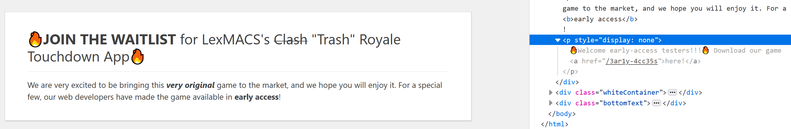
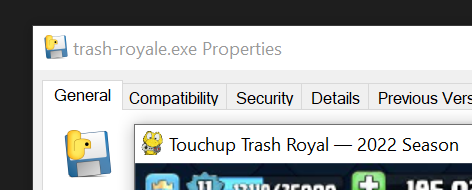
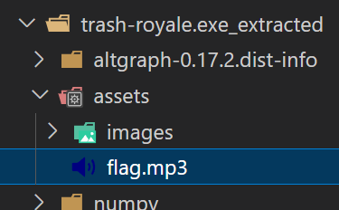

# misc/Trash Royale

## Challenge

Find the flag, and make sure its wrapped in LITCTF{}

Ugh, I keep forgetting my password for https://spectacle-deprive4-launder.herokuapp.com/, so I will just it here.
<br>
Username: LexMACS and Password: !codetigerORZ
<br>
<br>


## Solution

Logging on and navigating to `/home`, we see the early access section, but it seems we're not invited :(

_Also, we see a possible hint:_ The page title is in Morse code and clicking on it alerts "HEHEHAW", which is the translation of the Morse code.



Not invited? No matter! We poke around in the inspector, and find a hidden section that links to the early access page, `/3ar1y-4cc35s`.

From there, we can download the app [trashroyale.exe](https://spectacle-deprive4-launder.herokuapp.com/downloads/trash-royale.exe). _The page also has a weird warning:_

> Beware! This edition is very buggy and may have some surprise _sound_ effects!

We notice the app has the PyInstaller icon. (Also, running it, it has the pygame icon.)



So this `.exe` was created by PyInstaller. PyInstaller basically bundles files with the Python interpreter, so we should be able to extract them back. Searching online, we find an extractor at https://github.com/extremecoders-re/pyinstxtractor.



In the extracted contents, we find `flag.mp3`, which matches with the weird warning.
Playing it, we hear a bunch of "he"s and "haw"s. Seems like Morse code, as the hint suggested!

Transcribing "he"s as shorts and "haw"s as longs, we get
```
.... ...-- .... ...-- .... ...-- .... ....- .-- - .... .-. . . -.-. .-. --- .-- -.
```
which translates to `H3H3H3H4WTHREECROWN`. (Uppercase matches with the hint, but just trying both also works.) Wrapping in `LITCTF{}` as per the challenge, we get our flag.

## Flag

`LITCTF{H3H3H3H4WTHREECROWN}`
