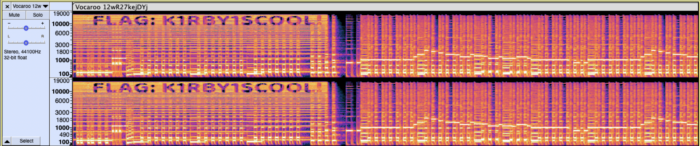

# misc/kirby!!!

## Challenge

Kirby is so cool! (Wrap your flag in LITCTF{})
 
 
The beginning is very loud so you should turn down your volume.
 
 
https://vocaroo.com/12wR27kejDYj
 
 
Original song: Green Grounds from Kirby Mass Attack

## Solution

Often in challenges involving an audio file (especially ones with a section that sounds broken), there is a message hidden in the spectrogram view of the file.

After downloading the file and putting it into [Audacity](https://www.audacityteam.org/) (or an online spectrogram viewer), we can click the track name on the left and change the viewing method from "Waveform" to "Spectrogram." Then, zooming in on the first few seconds of the track, we find this:

## Flag

`LITCTF{K1RBY1SCOOL!}`
