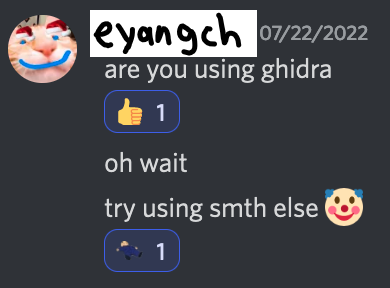

# rev/addition

## Challenge

Enter the flag, and it will be checked with addition!

[`addition`](https://drive.google.com/file/d/1hRfIzZrNdkjxLpUtnc_8uwyd2jYpOvhV/view)

## Solution

Let's disassemble it (`objdump -d`):
```
0000000000001070 <.text>:
    1070:	53                   	push   %rbx
    1071:	48 8d 3d 8c 0f 00 00 	lea    0xf8c(%rip),%rdi        # 2004 <__cxa_finalize@plt+0xfa4>
    1078:	31 c0                	xor    %eax,%eax
    107a:	48 83 ec 20          	sub    $0x20,%rsp
    107e:	48 89 e3             	mov    %rsp,%rbx       ; input stored here
    1081:	48 89 de             	mov    %rbx,%rsi
    1084:	e8 c7 ff ff ff       	callq  1050 <__isoc99_scanf@plt>
    1089:	31 c0                	xor    %eax,%eax       ; i = 0
    108b:	48 8d 0d 2e 30 00 00 	lea    0x302e(%rip),%rcx        # 40c0 <__cxa_finalize@plt+0x3060> ; important
    1092:	4c 8d 05 d7 ff ff ff 	lea    -0x29(%rip),%r8        # 1070 <__cxa_finalize@plt+0x10> ; data
    1099:	48 8d 3d c0 2f 00 00 	lea    0x2fc0(%rip),%rdi        # 4060 <__cxa_finalize@plt+0x3000> ; locations
    10a0:	eb 10                	jmp    10b2 <__cxa_finalize@plt+0x52>        ; FOR
    10a2:	66 0f 1f 44 00 00    	nopw   0x0(%rax,%rax,1)
    10a8:	48 83 c0 01          	add    $0x1,%rax       ; ++i
    10ac:	48 83 f8 18          	cmp    $0x18,%rax       ; i < 24 (decimal)
    10b0:	74 2b                	je     10dd <__cxa_finalize@plt+0x7d>        ; FOR end
    10b2:	48 63 14 81          	movslq (%rcx,%rax,4),%rdx       ; 40c0[i] FOR body
    10b6:	0f be 34 03          	movsbl (%rbx,%rax,1),%esi       ; input[i] (addresses skip by 1 for chars, 4 for ints)
    10ba:	41 0f b6 14 10       	movzbl (%r8,%rdx,1),%edx       ; 1070[40c0[i]] (the source is a byte, not an int!)
    10bf:	03 14 87             	add    (%rdi,%rax,4),%edx       ; + 4060[i]
    10c2:	89 14 81             	mov    %edx,(%rcx,%rax,4)       ; (not used again; just side effect)
    10c5:	39 f2                	cmp    %esi,%edx       ; input == 1070[40c0[i]] + 4060[i] (<<< KEY)
    10c7:	74 df                	je     10a8 <__cxa_finalize@plt+0x48>        ; FOR continue
    10c9:	48 8d 3d 39 0f 00 00 	lea    0xf39(%rip),%rdi        # 2009 <__cxa_finalize@plt+0xfa9> ; "wrong"
    10d0:	e8 6b ff ff ff       	callq  1040 <puts@plt>
    10d5:	48 83 c4 20          	add    $0x20,%rsp
    10d9:	31 c0                	xor    %eax,%eax
    10db:	5b                   	pop    %rbx
    10dc:	c3                   	retq   
    10dd:	48 8d 3d 2b 0f 00 00 	lea    0xf2b(%rip),%rdi        # 200f <__cxa_finalize@plt+0xfaf> ; "correct"
    10e4:	e8 57 ff ff ff       	callq  1040 <puts@plt>
    10e9:	eb ea                	jmp    10d5 <__cxa_finalize@plt+0x75>
    10eb:	0f 1f 44 00 00       	nopl   0x0(%rax,%rax,1)
    10f0:	f3 0f 1e fa          	endbr64 
    10f4:	0f ae 5c 24 fc       	stmxcsr -0x4(%rsp)
    10f9:	81 4c 24 fc 40 80 00 	orl    $0x8040,-0x4(%rsp)
    1100:	00 
    1101:	0f ae 54 24 fc       	ldmxcsr -0x4(%rsp)
    1106:	c3                   	retq   
...
```
eh... it's not too complicated. The key part is from `10b2` to `10c7`, with the data locations being initialized from `108b` to `1099`. We also see at `10ac` that it loops 24 times.

So, the flag is `1070[40c0[i]] + 4060[i]` for 24 `i`, where `1070` is in bytes and `40c0` and `4060` are in ints. We extract 24 sets of 4 bytes (for ints) from `40c0` and `4060`, and since the largest value at `40c0` is `79`, we extract from `1070` to at least `10e9`. (The values from `1070` come from the program instructions themselves, cool!)

We can just directly copy from the result of `objdump -s`.
Then, we just generate the flag, with addition!
```js
const [_4060, _40c0] = `\
 4060 0f000000 49000000 cbffffff b6ffffff  ....I...........
 4070 0c000000 16000000 33000000 62ffffff  ........3...b...
 4080 64000000 1c000000 7bffffff 2c000000  d.......{...,...
 4090 7effffff d5ffffff 26000000 5f000000  ~.......&..._...
 40a0 69000000 b3ffffff 5f000000 20000000  i......._... ...
 40b0 a8ffffff 47000000 61000000 7effffff  ....G...a...~...

 40c0 2b000000 5e000000 12000000 5a000000  +...^.......Z...
 40d0 59000000 1f000000 01000000 64000000  Y...........d...
 40e0 2e000000 0e000000 4c000000 0a000000  ........L.......
 40f0 79000000 6b000000 59000000 73000000  y...k...Y...s...
 4100 2e000000 3a000000 5f000000 6d000000  ....:..._...m...
 4110 04000000 70000000 49000000 27000000  ....p...I...'...`
    .split("\n\n").map(range=> // Calculate both with the same code. 2-in-1!
        range.match(/[0-9a-f]{8}/g).map(intstr=> // get array of sets of 8 bytes (ints)
            parseInt(intstr.match(/../g).reverse().join(""),0x10)|0 // reverse bytes and parse int
        )
    );
const _1070 = `\
 1070 53488d3d 8c0f0000 31c04883 ec204889  SH.=....1.H.. H.
 1080 e34889de e8c7ffff ff31c048 8d0d2e30  .H.......1.H...0
 1090 00004c8d 05d7ffff ff488d3d c02f0000  ..L......H.=./..
 10a0 eb10660f 1f440000 4883c001 4883f818  ..f..D..H...H...
 10b0 742b4863 14810fbe 3403410f b6141003  t+Hc....4.A.....
 10c0 14878914 8139f274 df488d3d 390f0000  .....9.t.H.=9...
 10d0 e86bffff ff4883c4 2031c05b c3488d3d  .k...H.. 1.[.H.=
 10e0 2b0f0000 e857ffff ffebea0f 1f440000  +....W.......D..`
    .match(/[0-9a-f]{8}/g) // get array of groups of 4 bytes
    .flatMap(group=>group.match(/../g)) // split into bytes (2 steps to avoid picking up line numbers)
    .map(p=>parseInt(p,0x10)); // parse int
new Array(24).fill(undefined).map((_,i)=>
    String.fromCharCode(_1070[_40c0[i]]+_4060[i])
).join("");
// LITCTF{add1ti0n_is_h4rd}
```
Note `4060` contains negative values! But since JS bitwise operations are 32-bit, a cool trick to fix is to do `x | 0`.


...oh.

## Flag

`LITCTF{add1ti0n_is_h4rd}`

## Alternate solution (if your native language isn't Assembly)

Putting the executable into [Ghidra](https://ghidra-sre.org/), we can see this function, which appears to be the one that checks our flag:

```c
undefined8 FUN_00101070(void)

{
  char cVar1;
  code cVar2;
  long lVar3;
  char local_28 [32];
  
  __isoc99_scanf(&DAT_00102004);
  lVar3 = 0;
  do {
    cVar1 = local_28[lVar3];
    cVar2 = FUN_00101070[(int)(&DAT_001040c0)[lVar3]];
    (&DAT_001040c0)[lVar3] = (uint)(byte)cVar2 + (&DAT_00104060)[lVar3];
    if ((uint)(byte)cVar2 + (&DAT_00104060)[lVar3] != (int)cVar1) {
      puts("wrong");
      return 0;
    }
    lVar3 = lVar3 + 1;
  } while (lVar3 != 0x18);
  puts("correct");
  return 0;
}
```

The code looks very complicated at first, but we can see `local_28` is likely the array the input is scanned into. Then, `lVar3` is a counter that loops 24 times. `local_28` is compared character-by-character (`cVar1`) with `cVar2 + 00104060[lVar3]`. `cVar2` is equal to `00101070[001040c0[lVar3]]`, so each character of the flag is given by `00101070[001040c0[lVar3]] + 00104060[lVar3]`. By double-clicking on the addresses in Ghidra, we can view the memory stored at those addresses. Then, we can continue in a manner similar to the previous solution.

## Notes

We gave up on the Ghidra approach because we were too intimidated by the weird variables, and also:



sorry for not being as orz as eyangch :(
