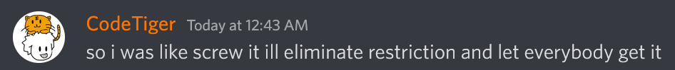

# web/CTF

## Challenge

Woah, [a Capture The Flag challenge](http://litctf.live:31780/), where players capture each other's flags, in a tournament called Capture The Flag? This is so original :O I do need a break from the standard web anyway I guess.

[CTF.zip](https://drive.google.com/uc?export=download&id=1yuA0wX9vkLQObn4L7tJl-rLsICVAu0sC)

## "Solution"

I tried logging in with the username `x` and password `x` (the placeholder credentials in the codebase), and it turns out that that account already won the flag. Thanks, whoever won it already!

...oh.

## Flag

I forgot and the service is down now :(
