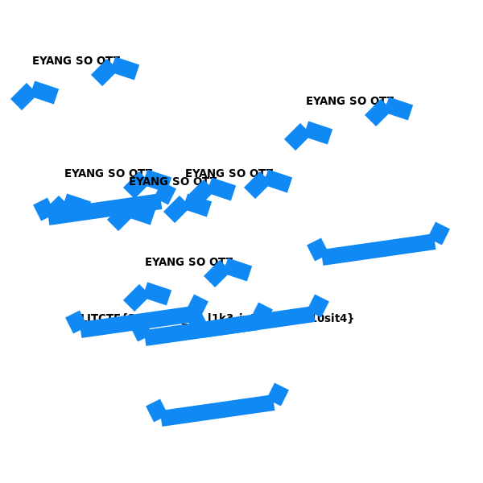

# web/EYANGCH Fan Art Maker 2.0

## Challenge

Unfortunately the last Fan Art maker had an unintended extremely easy solution. Frankly I am disappointed by people's willingness to take the easy route when it comes to ORZing Eyang. To make up for it, here is more [EYANG OTZ OTZ OTZ](http://litctf.live:45392/)

[EyangchFanArt2.zip](https://drive.google.com/uc?export=download&id=1Uc8QfAj9HnOZ9y4IdZpZrshZN4CQp6Qc)

## Solution

*Note: the following solution works for both this challenge and the original EYANGCH Fan Art Maker. However, it does not work on EYANGCH Fan Art Maker 3.0.*

If we don't type anything into the text box, we get the following output:



Those blue rectangle things sure are annoying. If we could just make them disappear, we could get the flag.

Indeed, it is possible to do this! Digging into the source code (specifically the `main.js` file) reveals that the following code is blocking the flag from being visible:

```xml
<component name="EYANGOTZ">
	<component name="eyes1">
		<line x1="10" y1="80" x2="30" y2="60" color="#1089f5" width="20"></line>
		<line x1="30" y1="60" x2="60" y2="70" color="#1089f5" width="20"></line>
	</component>
	<component name="eyes2">
		<line x1="110" y1="50" x2="130" y2="30" color="#1089f5" width="20"></line>
		<line x1="130" y1="30" x2="160" y2="40" color="#1089f5" width="20"></line>
	</component>
	<component name="mouth">
		<line x1="40" y1="200" x2="50" y2="220" color="#1089f5" width="20"></line>
		<line x1="50" y1="220" x2="190" y2="200" color="#1089f5" width="20"></line>
		<line x1="190" y1="200" x2="200" y2="180" color="#1089f5" width="20"></line>
	</component>
	<text x="30" y="30" font="bold 10pt Arial">EYANG SO OTZ</text>
</component>
<EYANGOTZ x="10" y="50"></EYANGOTZ>
<EYANGOTZ x="350" y="100"></EYANGOTZ>
<EYANGOTZ x="50" y="190"></EYANGOTZ>
<EYANGOTZ x="130" y="200"></EYANGOTZ>
<EYANGOTZ x="200" y="190"></EYANGOTZ>
<EYANGOTZ x="150" y="300"></EYANGOTZ>
```

The code we submit to the website will be appended to this. So we can just redefine the `EYANGOTZ` component to have nothing in it:

```xml
<component name="EYANGOTZ"></component>
```

and if we enter this code and click submit, the flag becomes visible!

## Flag

`LITCTF{3y4ngCH_15_l1k3_ju5t_s0_g3n10sit4}`
